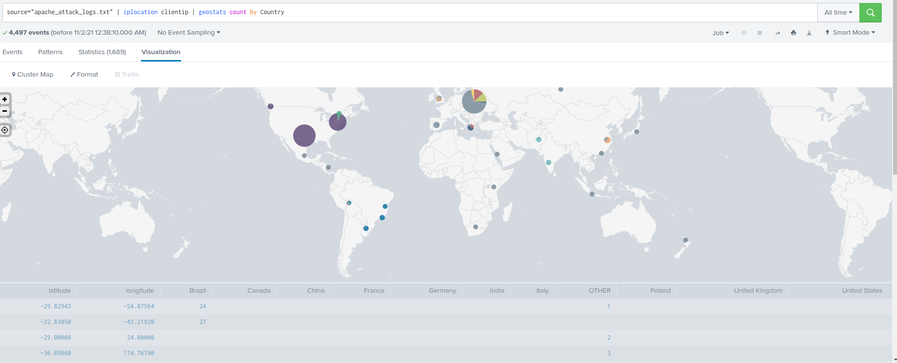

## Part 1: Windows Server Attack

- [apache attack file](apache_attack_logs)
- [apache log file](apache_logs)
- [Windows server attack file](windows_server_attack_logs)
- [Windows server logs](windows_server_logs)

### Question 1

- Several users were impacted during the attack on March 25th.
    - Based on the attack signatures, primarily user_a and user_k. A suspicious number of events with the signature “A user account was locked out” were detected in the 1:00 AM and 2:00 AM hours, primarily from user_a. During the 9:00 AM and 10:00 AM hours.

 - what mitigations would you recommend to protect each user account? Provide global mitigations that the whole company can use and individual mitigations that are specific to each user.

    - Based on these attack signatures, the SOC team at VSI recommend the following mitigations:
    
    - User accounts should be locked out after 5 incorrect attempts. This would decrease the vulnerability of several user accounts, as 805 total lockouts occurred during the 1:00 AM hour.
    - User account was locked out.
    - Users should only be allowed to attempt to reset their password once in any 15 hours period. During the 9:00 AM hour, 1,258 total attempts were made to reset a password. Limiting the number of times a     user can reset their password would mitigate this vulnerability.

    - individual user accounts, users should be required to use some sort of multi-factor authentication. for example (second passowrd)

### Question 2

- VSI has insider information that JobeCorp attempted to target users by sending "Bad Logins" to lock out every user.
What sort of mitigation could you use to protect against this?
    
    - Allow a set number of "bad logins", once the threshold is met, a text/email would be sent
      to the victim user, rather than locking them out from the get go.
    
    - Online Services Should Send Reset Links Or Send Code Over Phone Calls.
    
    - If three or more Bad Logins are detected originating from a single IP address, that  IP address should be blacklisted and prevented from accessing the user account login in the future.

## Part 2: Apache Webserver Attack:

### Question 1

- Based on the geographic map, recommend a firewall rule that the networking team should implement.
Provide a "plain english" description of the rule.
    - VSI’s Apache Webserver was attacked on March 25, 2020 between the hours of 6:00 PM and 9:00 PM. Based on available data, it seems this attack originated in Kiev, Ukraine. To mitigate against future attacks from the same threat actor, the SOC team recommends the following firewall rule be implemented:
    - Block all incoming HTTP traffic where the source IP = 79.171.127.34 & IP= 194.105.145.147 comes from the country of Ukraine

geographic map of incoming traffic during the attack

The top 10 countries by source IP before the attack is shown below. 

The top 10 countries by source IP during the attack is shown below. 

during the attack Ukraine accounts for the most amount of international traffic. Blocking any traffic from Ukraine would have very little impact on the day-to-day operations of VSI and would prevent this threat actor from further attacking VSI.

### Question 2

- VSI has insider information that JobeCorp will launch the same webserver attack but use a different IP each time in order to avoid being stopped by the rule you just created.
- What other rules can you create to protect VSI from attacks against your webserver?

- The insider information that the JobeCorp will or should launch and use a different IP address each time in order to avoid being stopped by the above firewall rule. To mitigate against future attacks, the SOC team recommends the following firewall rules be implemented:

    - Block any IP address which generates three or more consecutive POST requests to the login page (“/VSI_Account_logon.php”). This would prevent any brute-force attacks on the login page, regardless of source IP.
    
    - limited on concurrent requests or total requests over a given duration (50 requests per minute) can be an excellent way to reject traffic and maintain service stability.

    - Block any IP address which generates three or more consecutive POST requests identified by the user agent string “Mozilla/4.0 (compatible; MSIE 6.0; Windows NT 5.2; SV1; .NET CLR 2.0.50727987787; InfoPath.1)”. During the attack, 1,296 requests had that user agent string, while very little traffic during normal operation has that user agent.

Severality of the attack
